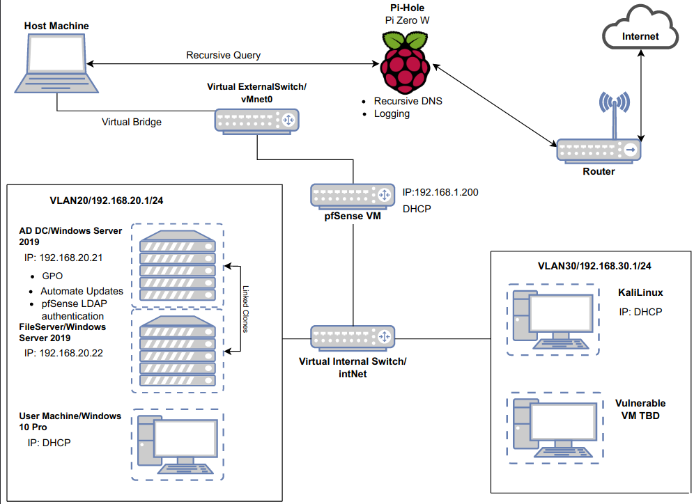

Here's a rundown of what I accomplished in this project:

Group Policy Objects (GPO): I established GPOs to streamline the management of devices. This allowed for consistent policy enforcement and easier administration.

Centralized File Server: I set up a central file server, ensuring that files and data are stored securely and can be accessed conveniently by authorized personnel.

Enhanced Network Security: I compartmentalized my home lab network traffic using VLAN. This also minimized the potential attack surface.

Integration with pfsense LDAP: I integrated pfsense LDAP with Windows DC, allowing secure and seamless AD logins.

Pi-Hole Deployment: To enhance user experience and privacy, I employed Pi-Hole as a domain-wide ad-blocker and a recursive DNS. This move significantly reduced intrusive ads, sped up web browsing for users, improved the resolution of domain names, and provided a more reliable browsing experience.

